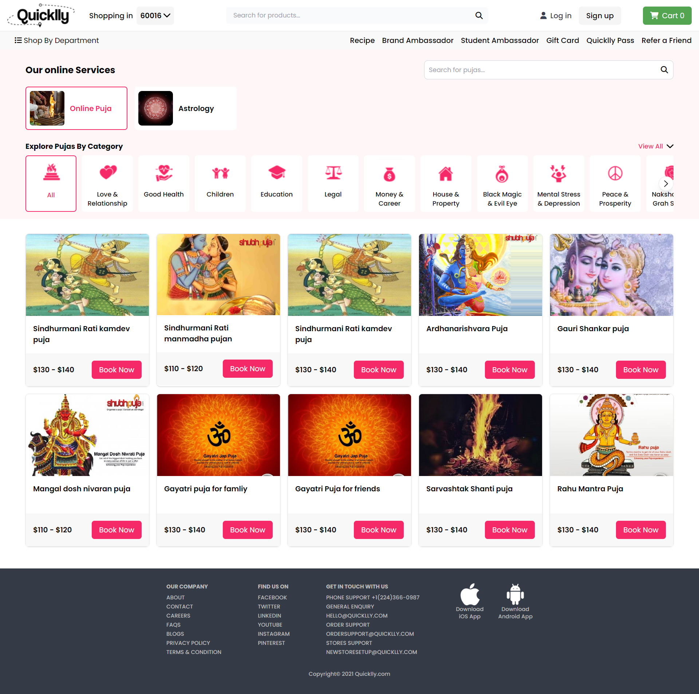
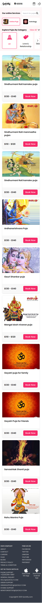

# Quicklly Service Page

This project involves the design and development of the Quicklly service page using the [Adobe XD mockup](https://xd.adobe.com/view/fbb0d735-9f43-495d-ba7d-c478b89a92b3-aee3/screen/2ab1368d-fd42-407c-b1c7-d26aa4f1e036/). The page allows users to view various service categories and products, designed to offer a seamless and interactive user experience.

## 🚀 Demo

<video controls src="assets/demo/Quicklly-desktop-demo.mp4" title="Desktop view"></video>
<video controls src="assets/demo/Quicklly-mobile-demo.mp4" title="Mobile view"></video>

## 🛠️ Tech Stack

- **Frontend:** HTML, JavaScript, AJAX, TailwindCSS
- **Backend:** PHP
- **Database:** MySQL

## 📋 Features

- **Dynamic Category Display:** Categories and products are fetched dynamically from the backend using AJAX.
- **Product Filtering:** Users can filter products based on selected categories, services.
- **Interactive UI:** The UI is designed using TailwindCSS for a modern and responsive layout.
- **AJAX:** Used for seamless and smooth data fetching without reloading the page.

## 📂 Project Structure

    ├── assets/
    │   ├── images/           # Images and icons
    │   ├── demo/             # Screen recordings
    │   ├── js/               # Js files
	|   |	├── main.js       # Main JavaScript file
    ├── backend/
    │   ├── api/
    │   │   ├── category.php  # API for fetching categories
    │   │   ├── product.php   # API for fetching products
    │   │   ├── service.php   # API for fetching services
    │   ├── class/            # Class files for tables
    │   ├── core/             # Includes database connection file
    ├── index.html            # Main HTML file
    ├── quicklly.sql          # sql file
    └── README.md             # Project documentation


## 📦 Setup and Installation

1. **Clone the repository:**
    ```bash
    git clone git@github.com:Rahul7raj/Quicklly-Services-Page.git
    ```
2. **Navigate to the project directory:**
    ```bash
    cd quicklly-service-page
    ```
3. **Set up the backend:**
   - Make sure you have a PHP server running (e.g., XAMPP, WAMP).
   - Place the project in the server's root directory (e.g., `htdocs` for XAMPP).

4. **Import the Database:**
   - Create a MySQL database.
   - Import the SQL file provided in the `main project` folder.

5. **Run the Project:**
   - Open the project in the browser:
     ```
     http://localhost/quicklly-service-page
     ```

## 📖 Usage

- **View Services:** Browse through various service categories.
- **Filter Products:** Click on a category to filter products dynamically.
- **Responsive Design:** The page is designed to be responsive across desktop and mobile devices.

## 📹 Media

### Screenshot



### Recording
<video controls src="assets/demo/Quicklly-desktop-demo.mp4" title="Desktop View"></video>
<video controls src="assets/demo/Quicklly-mobile-demo.mp4" title="Mobile View"></video>

## 👤 Author

**Rahul K Raj (Rahul Kumar Kushvaha)**

- LinkedIn: [Rahul K Raj](https://www.linkedin.com/in/rahul-k-raj/)
- GitHub: [rahulkraj](https://github.com/Rahul7raj)
- Connect With Me: [@rahulkushvaha](https://pageraja.com/rahulkraj/)
